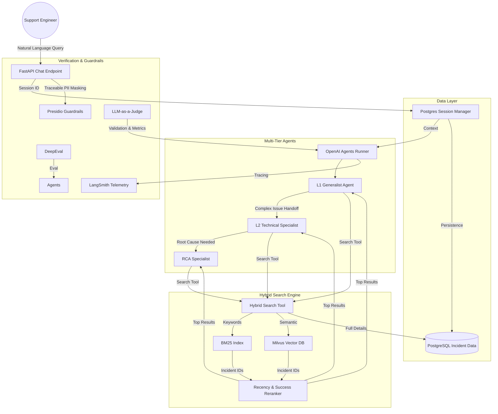

# Incident Assistant Architecture & Design

## Architecture Diagram

## Design Decisions & Trade-offs

### 1. Hybrid Search (Milvus + BM25)
- **Decision**: Combined vector search (Milvus) with keyword search (BM25).
- **Reasoning**: BM25 is excellent for specific identifiers (Error Codes, Ticket IDs) which vector search sometimes misses. Semantic search handles the "intent" of natural language queries.
- **Trade-off**: Higher complexity than single search, requiring careful weighting of scores.

### 2. Multi-tier Handoff (L1 -> L2 -> L3)
- **Decision**: Hierarchical agent structure mirroring real support workflows.
- **Reasoning**: Ensures that simple queries are handled cheaply and fast, while specialized talent (L3) is only invoked for high-complexity systemic issues.
- **Trade-off**: Increased latency for complex queries due to multiple handoff steps.

### 3. PostgreSQL Session Management
- **Decision**: Used the existing project schema for "Advanced" sessions.
- **Reasoning**: Provides durability, conversation branching, and detailed usage tracking that simple in-memory or flat-file sessions lack.
- **Trade-off**: Requires database connectivity and management.

### 4. PII Masking (Presidio)
- **Decision**: Integrated Microsoft Presidio in the API layer.
- **Reasoning**: Security is paramount in IT support where logs often contain sensitive user data.
- **Trade-off**: Processing overhead for every message.
