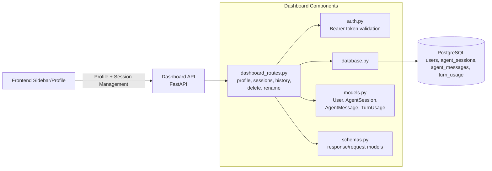

# Dashboard API Architecture

```mermaid
flowchart LR
    FE[Frontend Sidebar/Profile]
    DASH[Dashboard API<br/>FastAPI]

    subgraph DASH_LAYER[Dashboard Components]
        DR[dashboard_routes.py<br/>profile, sessions, history,<br/>delete, rename]
        AUTH_UTIL[auth.py<br/>Bearer token validation]
        DB_UTIL[database.py]
        MODELS[models.py<br/>User, AgentSession,<br/>AgentMessage, TurnUsage]
        SCHEMAS[schemas.py<br/>response/request models]
    end

    PG[(PostgreSQL<br/>users, agent_sessions,<br/>agent_messages, turn_usage)]

    FE -->|Profile + Session Management| DASH
    DASH --> DR
    DR --> AUTH_UTIL
    DR --> SCHEMAS
    DR --> MODELS
    DR --> DB_UTIL
    DB_UTIL --> PG
```

