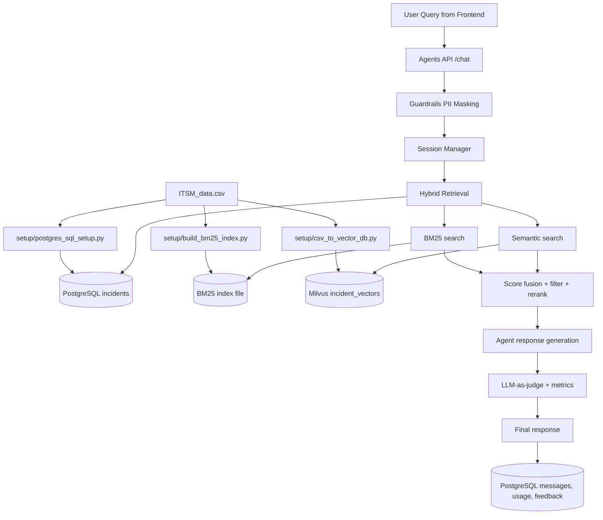

# Data Workflow Diagram

```mermaid
flowchart TD
    A[ITSM_data.csv]
    B[setup/postgres_sql_setup.py]
    C[setup/build_bm25_index.py]
    D[setup/csv_to_vector_db.py]

    E[(PostgreSQL incidents)]
    F[(BM25 index file)]
    G[(Milvus incident_vectors)]

    H[User Query from Frontend]
    I[Agents API /chat]
    J[Guardrails PII Masking]
    K[Session Manager]
    L[Hybrid Retrieval]
    M[BM25 search]
    N[Semantic search]
    O[Score fusion + filter + rerank]
    P[Agent response generation]
    Q[LLM-as-judge + metrics]
    R[Final response]
    S[(PostgreSQL messages, usage, feedback)]

    A --> B --> E
    A --> C --> F
    A --> D --> G

    H --> I --> J --> K --> L
    L --> M --> F
    L --> N --> G
    L --> E
    M --> O
    N --> O
    O --> P --> Q --> R
    R --> S
```

