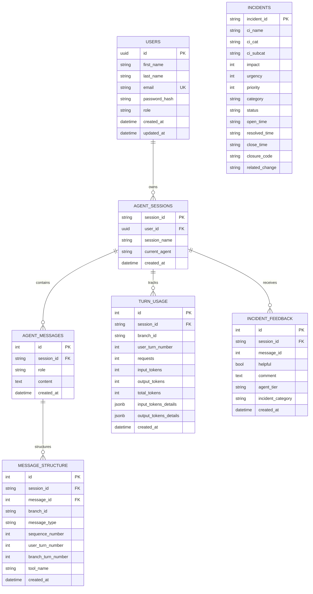

# ER Diagram

```mermaid
erDiagram
    USERS ||--o{ AGENT_SESSIONS : owns
    AGENT_SESSIONS ||--o{ AGENT_MESSAGES : contains
    AGENT_SESSIONS ||--o{ TURN_USAGE : tracks
    AGENT_SESSIONS ||--o{ INCIDENT_FEEDBACK : receives
    AGENT_MESSAGES ||--o{ MESSAGE_STRUCTURE : structures

    USERS {
        uuid id PK
        string first_name
        string last_name
        string email UK
        string password_hash
        string role
        datetime created_at
        datetime updated_at
    }

    AGENT_SESSIONS {
        string session_id PK
        uuid user_id FK
        string session_name
        string current_agent
        datetime created_at
    }

    AGENT_MESSAGES {
        int id PK
        string session_id FK
        string role
        text content
        datetime created_at
    }

    MESSAGE_STRUCTURE {
        int id PK
        string session_id FK
        int message_id FK
        string branch_id
        string message_type
        int sequence_number
        int user_turn_number
        int branch_turn_number
        string tool_name
        datetime created_at
    }

    TURN_USAGE {
        int id PK
        string session_id FK
        string branch_id
        int user_turn_number
        int requests
        int input_tokens
        int output_tokens
        int total_tokens
        jsonb input_tokens_details
        jsonb output_tokens_details
        datetime created_at
    }

    INCIDENT_FEEDBACK {
        int id PK
        string session_id FK
        int message_id
        bool helpful
        text comment
        string agent_tier
        string incident_category
        datetime created_at
    }

    INCIDENTS {
        string incident_id PK
        string ci_name
        string ci_cat
        string ci_subcat
        int impact
        int urgency
        int priority
        string category
        string status
        string open_time
        string resolved_time
        string close_time
        string closure_code
        string related_change
    }
```

