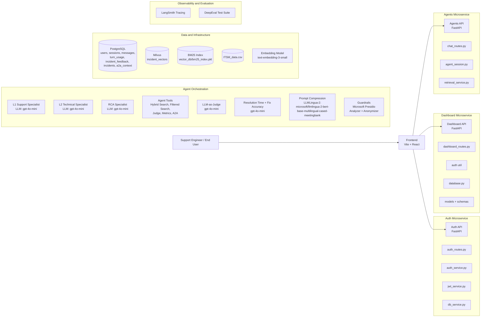
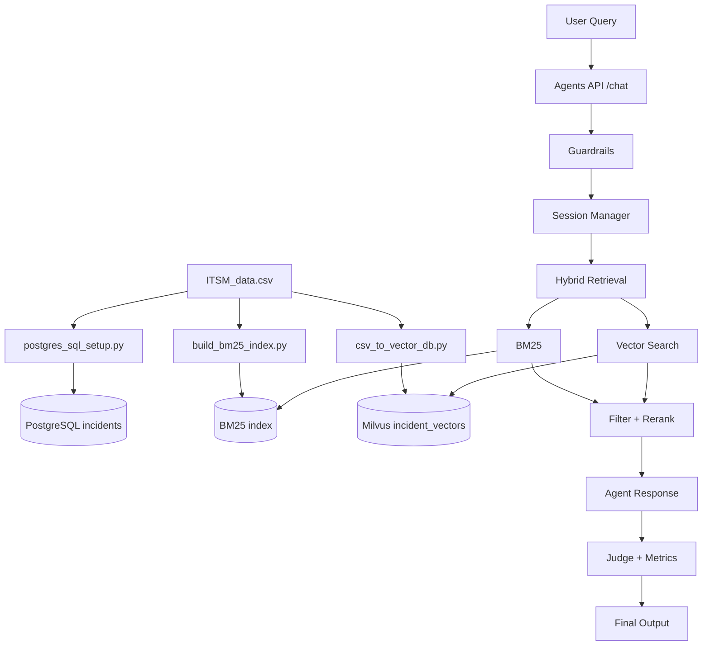
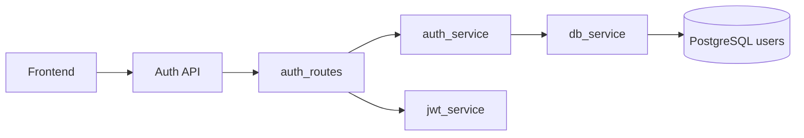
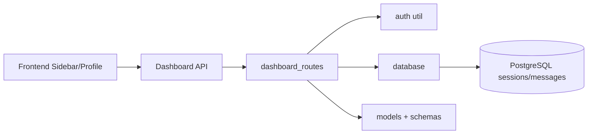
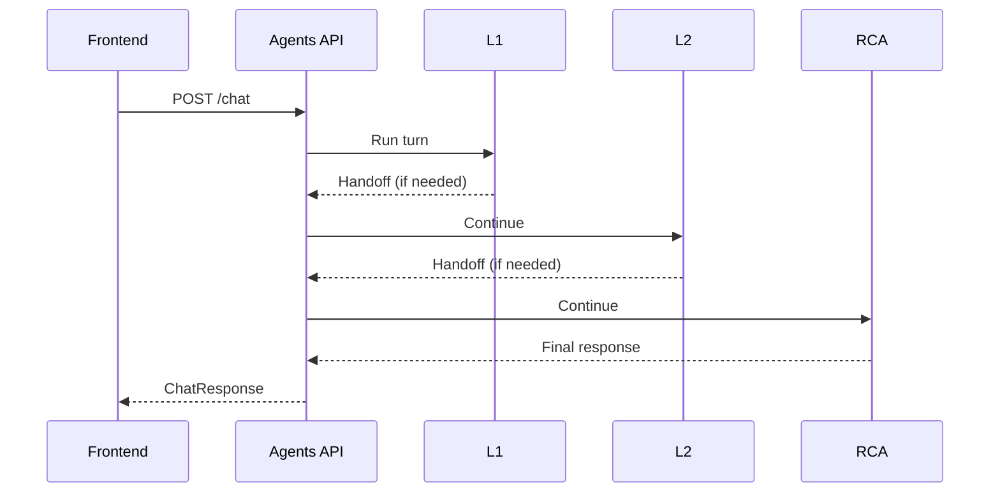

# Prompt: Generate 10-Slide Final Deck (With Embedded Diagrams)

Use this prompt in your presentation-generation tool:

---

Create a **10-slide deck exactly** for:
**AI-Powered Incident Knowledge Base Assistant**

Constraints:
1. Exactly 10 slides total.
2. Include:
   - Slide 1 = Title Slide
   - Slide 9 = GitHub Slide (minimal text)
   - Slide 10 = Thank You Slide
3. Keep content concise and presentation-ready.
4. Convert the Mermaid diagrams below into clean visual diagrams in slides.
5. Include short speaker notes for each slide.

Project context to reflect:
- Hybrid incident retrieval (BM25 + Milvus vector search)
- Multi-tier agents (L1 -> L2 -> RCA)
- APIs: Auth, Dashboard, Agents
- Guardrails: Microsoft Presidio
- LLM: gpt-4o-mini
- Embeddings: text-embedding-3-small
- Prompt compression: LLMLingua-2 (`microsoft/llmlingua-2-bert-base-multilingual-cased-meetingbank`)
- Evaluation: DeepEval
- Observability: LangSmith

Design decisions to emphasize in narrative and visual styling:
- Architecture choice:
  - Microservices split (Auth, Dashboard, Agents) for separation of concerns and independent scaling.
- Retrieval choice:
  - Hybrid retrieval (BM25 + vector search) to handle both exact keyword matches and semantic intent.
- Agent workflow choice:
  - Multi-tier support model (L1 -> L2 -> RCA) to mimic real support escalation.
- Safety choice:
  - Presidio-based guardrails with domain-aware tuning for IT support content.
- Cost-performance choice:
  - `gpt-4o-mini` and `text-embedding-3-small` for practical latency/cost balance.
- State and analytics choice:
  - PostgreSQL for durable sessions, messages, usage, feedback, and A2A context.
- Quality and ops choice:
  - DeepEval for response quality checks and LangSmith for traceability.

Style guidance (minimal but explicit):
- Use an “engineering decision journey” storytelling style, not generic marketing style.
- For each major section, show: Decision -> Why -> Trade-off -> Outcome.
- Keep slides concise and evidence-based; avoid decorative fluff.

Problem statement context (must be reflected in Slide 2):
- IT support teams repeatedly handle incidents such as server crashes, DB timeouts, auth failures, and network disruptions.
- Organizations have large historical incident datasets, but manual search is slow and inefficient.
- Support engineers need fast retrieval of similar incidents and their resolution steps from natural-language queries.
- Target objective:
  - Build a semantic retrieval system for natural-language incident troubleshooting.
  - Return relevant historical incidents with resolution summaries.
- Requirement coverage to mention briefly:
  - Basic: RAG similarity search, hybrid search, triage, metadata filtering, guardrails, routing, API exposure.
  - Advanced: DeepEval, custom metrics, reranking, LLM-as-judge, token optimization, L1->L2->L3, A2A sharing, RCA collaboration, feedback loop.
- Dataset context:
  - IT Incident Management Event Log (ServiceNow-like records).
  - CSV fields include priority/impact/urgency and incident lifecycle details.

GitHub link to include on Slide 9:
`https://github.com/anubroto-ghose/capstone-proj-FDE-training.git`

Required 10-slide structure:
1. Title
2. Problem and Goal
3. Live Demo Workflow (UI + sample queries + observed outputs)
4. System Architecture (use diagram)
5. Data Workflow (use diagram)
6. API Architecture (Auth + Dashboard) (use diagrams)
7. Agent Orchestration + Sequence (use diagram)
8. Design Decisions and Trade-offs
9. GitHub (minimal instructions, include link and one short line only)
10. Thank You

Important pacing instruction:
- This is a short panel. Keep Slides 1-2 very concise and move to demo early at Slide 3.
- Demo first, then explain architecture/design.

Slide 3 (Live Demo Workflow) must include:
1. Login
2. Submit incident query
3. Show retrieved response evidence
4. Optional L1 -> L2/RCA handoff example
5. Feedback submission
6. Session rename/search in sidebar

Mandatory coverage mapping (must be visible in slide content + notes):
- System Demo / Working Demo:
  - Covered in Slide 3 with full workflow.
- Architecture Walkthrough / Architecture Understanding:
  - Covered in Slides 4-7.
- Code Understanding:
  - Mention key code modules and API responsibilities in Slides 6-8.
- Security Basics:
  - Include explicit bullets on auth (JWT), guardrails (PII masking), and safe handling assumptions.
  - Place these in Slide 8 (or Slide 6 if layout fits).
- Evaluation Methodology:
  - Include explicit bullets for DeepEval metrics and LangSmith tracing.
  - Place these in Slide 8.
- Panel Q&A:
  - Since slide count is fixed at 10, include a short "likely Q&A and answers" section in speaker notes for Slides 8-10.
  - Cover: scalability, security, model choice, and future improvements.

Use the following Mermaid diagram definitions as source visuals:

System Architecture:

Data Workflow:

Auth API Architecture:

Dashboard API Architecture:

Sequence (L1 -> L2 -> RCA):

---
