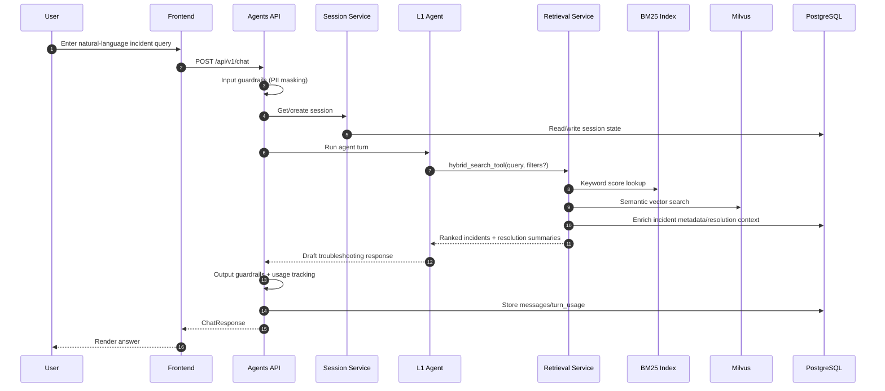
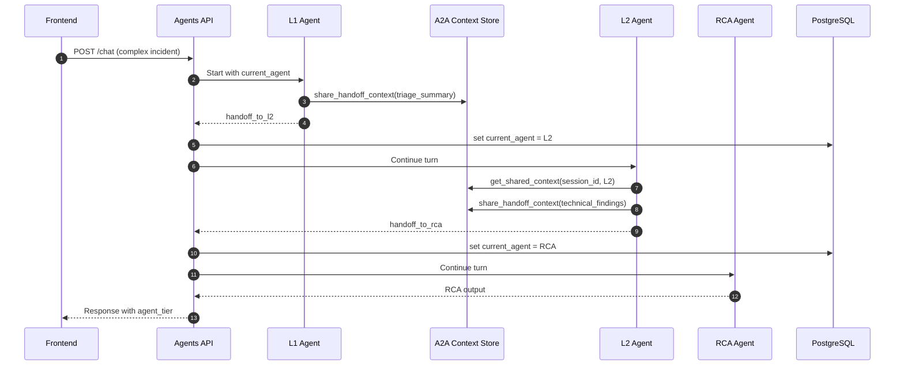

# Sequence Diagrams

## 1) Chat Query and Retrieval Sequence

```mermaid
sequenceDiagram
    autonumber
    participant User
    participant FE as Frontend
    participant Agents as Agents API
    participant Session as Session Service
    participant L1 as L1 Agent
    participant Search as Retrieval Service
    participant BM25 as BM25 Index
    participant Milvus as Milvus
    participant PG as PostgreSQL

    User->>FE: Enter natural-language incident query
    FE->>Agents: POST /api/v1/chat
    Agents->>Agents: Input guardrails (PII masking)
    Agents->>Session: Get/create session
    Session->>PG: Read/write session state
    Agents->>L1: Run agent turn
    L1->>Search: hybrid_search_tool(query, filters?)
    Search->>BM25: Keyword score lookup
    Search->>Milvus: Semantic vector search
    Search->>PG: Enrich incident metadata/resolution context
    Search-->>L1: Ranked incidents + resolution summaries
    L1-->>Agents: Draft troubleshooting response
    Agents->>Agents: Output guardrails + usage tracking
    Agents->>PG: Store messages/turn_usage
    Agents-->>FE: ChatResponse
    FE-->>User: Render answer
```

## 2) Handoff Sequence (L1 -> L2 -> RCA)

```mermaid
sequenceDiagram
    autonumber
    participant FE as Frontend
    participant Agents as Agents API
    participant L1 as L1 Agent
    participant A2A as A2A Context Store
    participant L2 as L2 Agent
    participant RCA as RCA Agent
    participant PG as PostgreSQL

    FE->>Agents: POST /chat (complex incident)
    Agents->>L1: Start with current_agent
    L1->>A2A: share_handoff_context(triage_summary)
    L1-->>Agents: handoff_to_l2
    Agents->>PG: set current_agent = L2
    Agents->>L2: Continue turn
    L2->>A2A: get_shared_context(session_id, L2)
    L2->>A2A: share_handoff_context(technical_findings)
    L2-->>Agents: handoff_to_rca
    Agents->>PG: set current_agent = RCA
    Agents->>RCA: Continue turn
    RCA-->>Agents: RCA output
    Agents-->>FE: Response with agent_tier
```

