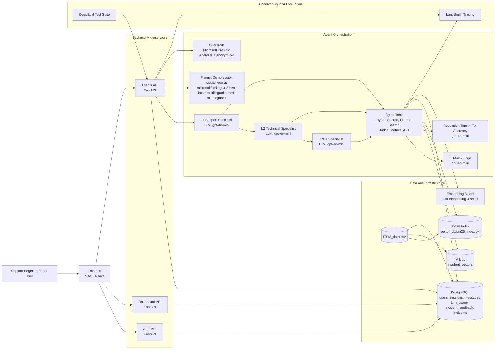

# System Architecture Diagram

```mermaid
flowchart LR
    U[Support Engineer / End User]
    FE[Frontend<br/>Vite + React]

    subgraph MS[Backend Microservices]
        AUTH[Auth API<br/>FastAPI]
        DASH[Dashboard API<br/>FastAPI]
        AGENTS[Agents API<br/>FastAPI]
    end

    subgraph AG[Agent Orchestration]
        L1[L1 Support Specialist<br/>LLM: gpt-4o-mini]
        L2[L2 Technical Specialist<br/>LLM: gpt-4o-mini]
        L3[RCA Specialist<br/>LLM: gpt-4o-mini]
        TOOLS[Agent Tools<br/>Hybrid Search, Filtered Search,<br/>Judge, Metrics, A2A]
        JUDGE[LLM-as-Judge<br/>gpt-4o-mini]
        METRICS[Resolution Time + Fix Accuracy<br/>gpt-4o-mini]
        COMP[Prompt Compression<br/>LLMLingua-2:<br/>microsoft/llmlingua-2-bert-base-multilingual-cased-meetingbank]
        GR[Guardrails<br/>Microsoft Presidio<br/>Analyzer + Anonymizer]
    end

    subgraph DATA[Data and Infrastructure]
        PG[(PostgreSQL<br/>users, sessions, messages,<br/>turn_usage, incident_feedback, incidents)]
        MV[(Milvus<br/>incident_vectors)]
        BM25[(BM25 Index<br/>vector_db/bm25_index.pkl)]
        CSV[(ITSM_data.csv)]
        EMB[Embedding Model<br/>text-embedding-3-small]
    end

    subgraph OBS[Observability and Evaluation]
        LS[LangSmith Tracing]
        DE[DeepEval Test Suite]
    end

    U --> FE
    FE --> AUTH
    FE --> DASH
    FE --> AGENTS

    AUTH --> PG
    DASH --> PG
    AGENTS --> PG

    AGENTS --> L1
    L1 --> L2
    L2 --> L3
    L1 --> TOOLS
    L2 --> TOOLS
    L3 --> TOOLS
    TOOLS --> JUDGE
    TOOLS --> METRICS
    AGENTS --> COMP
    AGENTS --> GR

    TOOLS --> MV
    TOOLS --> BM25
    TOOLS --> PG
    TOOLS --> EMB

    CSV --> BM25
    CSV --> MV
    CSV --> PG

    AGENTS --> LS
    TOOLS --> LS
    DE --> AGENTS
```
