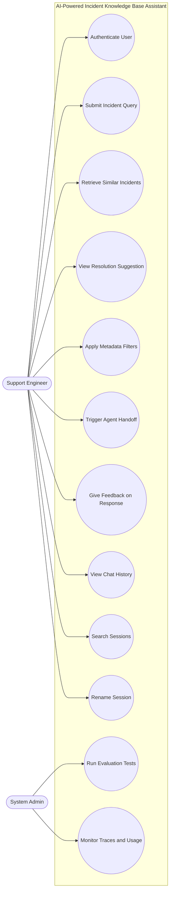

# Use Case Diagram

```mermaid
flowchart LR
    actorUser([Support Engineer])
    actorAdmin([System Admin])

    subgraph System[AI-Powered Incident Knowledge Base Assistant]
        UC1((Authenticate User))
        UC2((Submit Incident Query))
        UC3((Retrieve Similar Incidents))
        UC4((View Resolution Suggestion))
        UC5((Apply Metadata Filters))
        UC6((Trigger Agent Handoff))
        UC7((Give Feedback on Response))
        UC8((View Chat History))
        UC9((Search Sessions))
        UC10((Rename Session))
        UC11((Run Evaluation Tests))
        UC12((Monitor Traces and Usage))
    end

    actorUser --> UC1
    actorUser --> UC2
    actorUser --> UC3
    actorUser --> UC4
    actorUser --> UC5
    actorUser --> UC6
    actorUser --> UC7
    actorUser --> UC8
    actorUser --> UC9
    actorUser --> UC10

    actorAdmin --> UC11
    actorAdmin --> UC12
```

